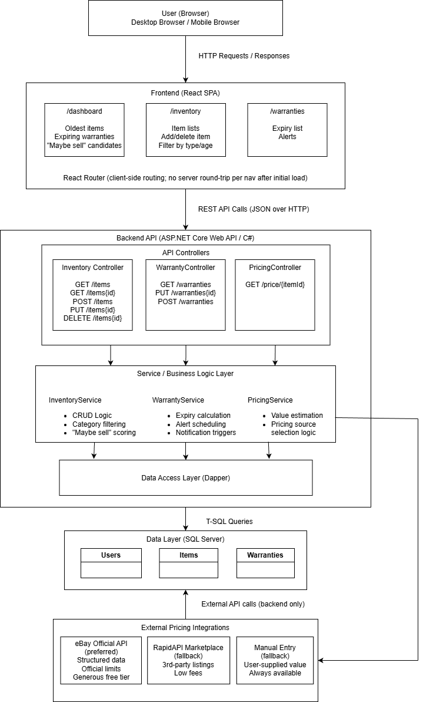
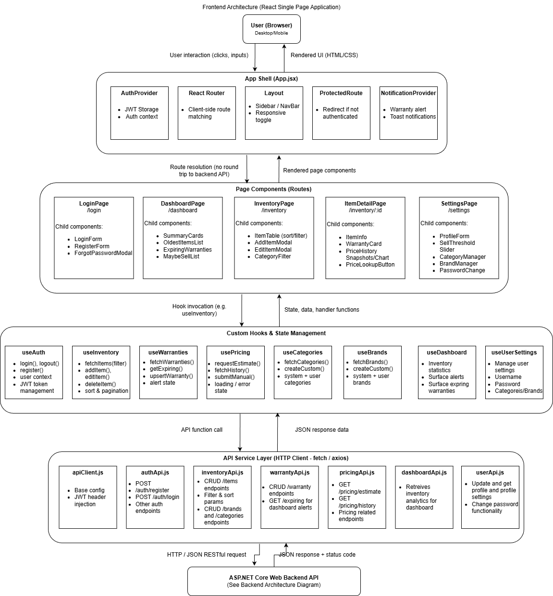
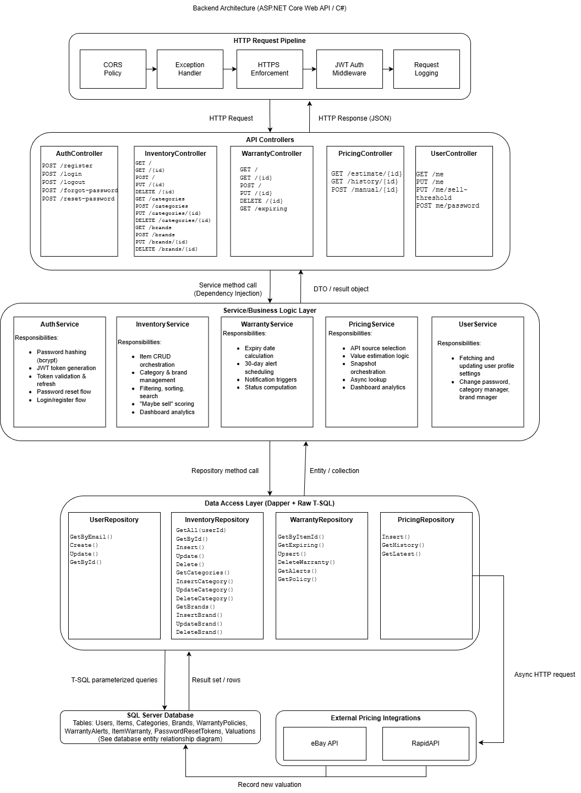
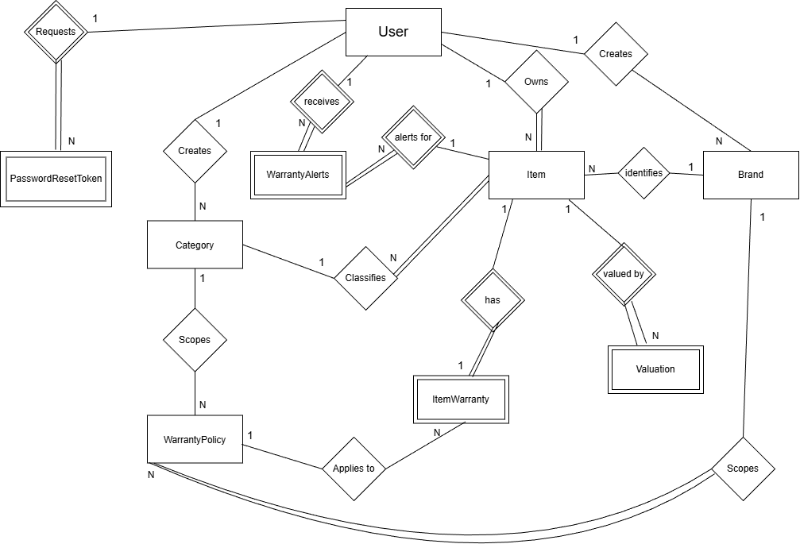

# TAMS — Technology Asset Management System

A personal web app for tracking consumer technology assets (PCs, components, phones, etc.). TAMS lets users catalog hardware, monitor warranty coverage, and estimate used-market value over time so that ownership decisions — keep, sell, or repair — are informed rather than guessed.

Built as the CMPS 490 Capstone Project (Spring 2026).

## Architecture

### System Architecture


### Frontend


### Backend


### Database


## Stack

- **Frontend** — React 19 + Vite + Tailwind CSS, React Router
- **Backend** — ASP.NET Core (.NET 10) Web API in C#, Dapper, JWT auth
- **Database** — Microsoft SQL Server (local instance, T-SQL, schema in `schema2.sql`)
- **Tests** — xUnit (backend), Vitest + React Testing Library (frontend)

## Project layout

```
TAMS/
├── my-app/              # React SPA (Vite)
├── server/
│   ├── Tams.Api/        # ASP.NET Core Web API
│   └── Tams.Api.Tests/  # xUnit tests
└── schema2.sql          # Database schema
```

## Prerequisites

- .NET 10 SDK
- Node.js 20+ and npm
- A local SQL Server instance (Developer or Express edition is fine)

## Getting started

### 1. Database

Make sure your local SQL Server is running. Apply the schema using SSMS, Azure Data Studio, or `sqlcmd`:

```powershell
sqlcmd -S . -E -i schema2.sql
```

`-S .` targets the default local instance and `-E` uses Windows authentication. Adjust if you're using a named instance (e.g. `-S .\SQLEXPRESS`) or SQL auth.

The default connection string in `appsettings.json` assumes a trusted connection to the default local instance:

```
Server=.;Database=TAMS;Trusted_Connection=True;TrustServerCertificate=True;
```

Update it if your instance name or auth differs.

### 2. Backend

```powershell
cd server\Tams.Api
dotnet run
```

The API listens on the URL printed in the console (typically `https://localhost:5001`). Connection string and JWT settings live in `appsettings.json` / `appsettings.Development.json`.

### 3. Frontend

```powershell
cd my-app
npm install
npm run dev
```

Vite serves the SPA at `http://localhost:5173`. Set `VITE_API_BASE_URL` in `my-app/.env` to point at the backend.

## Running tests

Backend:

```powershell
cd server\Tams.Api.Tests
dotnet test
```

Frontend:

```powershell
cd my-app
npm test
```
